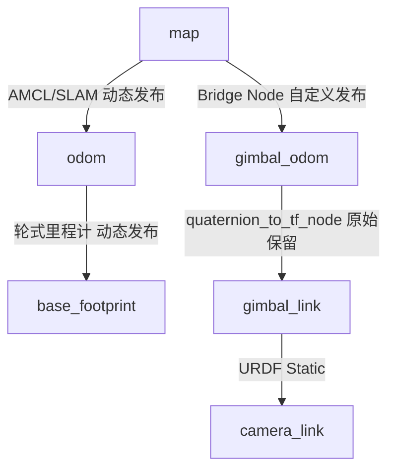

# 导航与自瞄 TF 树融合方案深度解析

## 1. 现状与核心诉求

### 1.1 当前现状
*   **自瞄系统**：依赖 `quaternion_to_tf_node`。
    *   它发布 `gimbal_odom` -> `gimbal_link`。
    *   **特性**：`gimbal_odom` 是一个“惯性坐标系”（性质类似指南针指向正北，不随底盘转动），`gimbal_link` 是枪口实际朝向。自瞄算法在这个局部关系下工作良好。
*   **导航系统**：依赖 `amcl/slam` 和 `wheel_odom`。
    *   它维护 `map` -> `odom` -> `base_footprint`。
    *   **特性**：`base_footprint` 随底盘转动。

### 1.2 核心诉求
1.  **共存**：导航和自瞄同时工作，互不干扰。
2.  **联动**：需要实现“导航到目标装甲板”。这要求在 `map` 坐标系下能解算出 `armor_plate` 的坐标。
3.  **最小改动**：**保留** `quaternion_to_tf_node`，不修改自瞄核心代码。

---

## 2. 核心矛盾解析：为什么不能直接“硬连”？

你之前的直觉非常准确：**“自瞄odom和导航odom不是同一个东西”**。

*   **如果直接把 `gimbal_odom` 固定在 `base_footprint` 上 (Static TF)**：
    *   当底盘旋转 90 度时，`base_footprint` 旋转了 90 度。
    *   作为子节点的 `gimbal_odom` 也会被迫旋转 90 度。
    *   但是，`gimbal_link` (云台) 的 IMU 数据是绝对角度。此时 `quaternion_to_tf_node` 仍在发布云台相对于世界的绝对角度。
    *   **结果**：云台的角度会被计算**两次**（底盘转了一次，IMU又算了一次），导致 TF 树中的枪口乱转，无法通过 TF 转换回 `map` 坐标系。

---

## 3. 推荐方案：幽灵跟随模式 (方案A)

### 3.1 方案原理
为了让两套系统合并为“同一棵 TF 树”而不发生冲突，我们采用**“并联”**结构，或者叫**“位置跟随，姿态分离”**策略。

我们需要编写一个简单的 **TF 桥接节点 (Bridge Node)**。

*   **逻辑**：让 `gimbal_odom` 像一个“幽灵”一样。
    *   **位置上**：它死死咬住机器人的中心（`base_footprint` 的位置）。
    *   **姿态上**：它完全无视底盘的旋转，永远保持朝向世界坐标系的初始方向（通常是正北，即 Quaternion(0,0,0,1)）。

### 3.2 TF 树结构图

融合后的 TF 树长这样：



**关键点说明**：
1.  **根节点统一**：都在 `map` 下，所以是同一棵树，可以互相 `lookupTransform`。
2.  **路径通畅**：从 `map` 到 `gimbal_link` 有路径：`map` -> `gimbal_odom` -> `gimbal_link`。
3.  **无环路**：`base_footprint` 和 `gimbal_odom` 互不隶属，它们是兄弟关系（或者叔侄关系），互不干扰。

---

## 4. 实现细节：Bridge Node 怎么写？

这个节点不需要改动现有的自瞄代码，它是一个新增的辅助节点。

### 4.1 伪代码逻辑

```python
# 这是一个伪代码，描述该节点的运行逻辑

while (ros_ok):
    # 1. 监听当前机器人在地图中的位置
    # 获取 map -> base_footprint 的变换
    try:
        transform = tf_buffer.lookup_transform("map", "base_footprint", time(0))
        current_x = transform.translation.x
        current_y = transform.translation.y
        current_z = transform.translation.z
    except:
        continue

    # 2. 构建要发布的变换：map -> gimbal_odom
    # 关键点：位置跟随底盘，但旋转锁死为 0 (Identity)
    new_msg = TransformStamped()
    new_msg.header.frame_id = "map"
    new_msg.child_frame_id = "gimbal_odom"  # 连接到自瞄的根

    # 3. 赋值位置 (加上适当的安装高度偏移)
    new_msg.transform.translation.x = current_x
    new_msg.transform.translation.y = current_y
    new_msg.transform.translation.z = current_z + 0.0 # 如果云台比底盘中心高，这里加高度

    # 4. 赋值旋转 (核心！绝对不要用底盘的旋转)
    # 永远保持正方向，因为 gimbal_odom 本质上是惯性系原点平移过来的
    new_msg.transform.rotation.x = 0.0
    new_msg.transform.rotation.y = 0.0
    new_msg.transform.rotation.z = 0.0
    new_msg.transform.rotation.w = 1.0

    # 5. 发布
    tf_broadcaster.sendTransform(new_msg)
```

### 4.2 为什么 quaternion_to_tf_node 不需要改？
`quaternion_to_tf_node` 的工作是：“读取 IMU (绝对角度)，发布 `gimbal_odom` -> `gimbal_link`”。
*   假设 IMU 读数是“朝东 (Yaw=-90)”。
*   我们的 Bridge 节点发布 `map` -> `gimbal_odom` 是“位置在车上，角度朝北”。
*   TF树查询 `map` -> `gimbal_link` = (朝北的平移) * (朝东的旋转) = **车在地图那个位置，且枪口朝东**。
*   **完美闭环**。

---

## 5. 如何实现“导航到目标装甲板”？

既然 TF 树已经通了，实现导航到目标就非常简单：

1.  **视觉识别**：自瞄相机识别到装甲板，得到 `camera_link` -> `armor` 的坐标 (x, y, z)。
2.  **TF 转换**：
    *   调用 `tf_buffer.transform("map", armor_pose_in_camera)`。
    *   TF 树会自动通过：`camera` -> `gimbal_link` -> `gimbal_odom` -> `map` 计算出装甲板在**地图上的绝对坐标**。
3.  **发送导航点**：
    *   将转换后的 `map` 坐标（保留 x, y，忽略 z）作为 Goal 发送给 Nav2。
    *   底盘就会规划路径过去。

---

## 6. 总结与检查清单

*   [x] **保留 `quaternion_to_tf_node`**：是的，它是自瞄精度的保证，不要动。
*   [x] **新建 `nav_aim_bridge` 节点**：按照上述逻辑，只发布 `map` -> `gimbal_odom` 的平移。
*   [x] **检查 TF Tree**：运行 `ros2 run tf2_tools view_frames`，确认 `map` 是唯一的根，所有节点都连通，且没有红色的报错。
*   [x] **初始化对齐**：注意，如果 IMU 上电时的 0 度不是地图的 0 度（正东/正北），可能需要在 Bridge 节点里加一个固定的静态偏置（Yaw Offset），这个测一下就知道了。

这个方案完美规避了你担心的“TF 树冲突”和“双重旋转”问题，是目前最稳健的做法。
